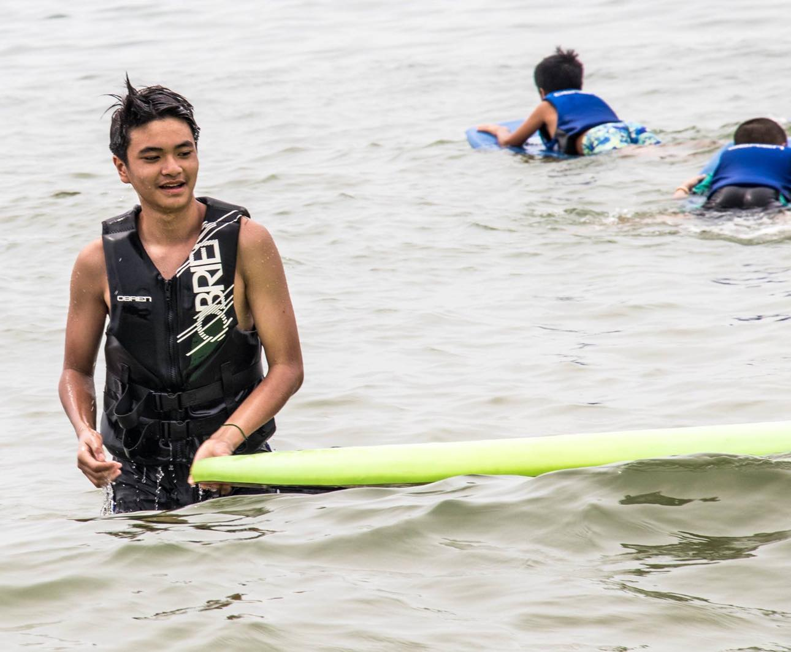
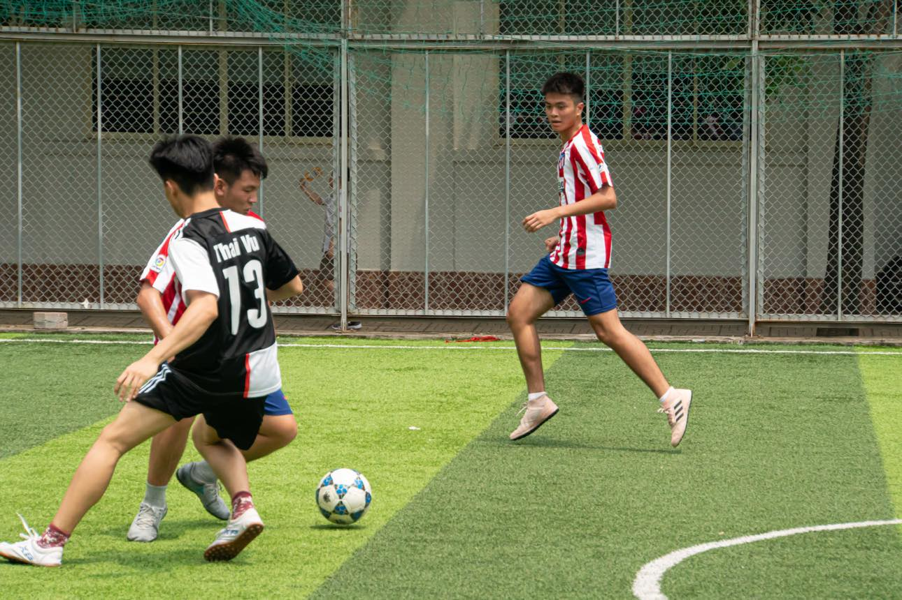
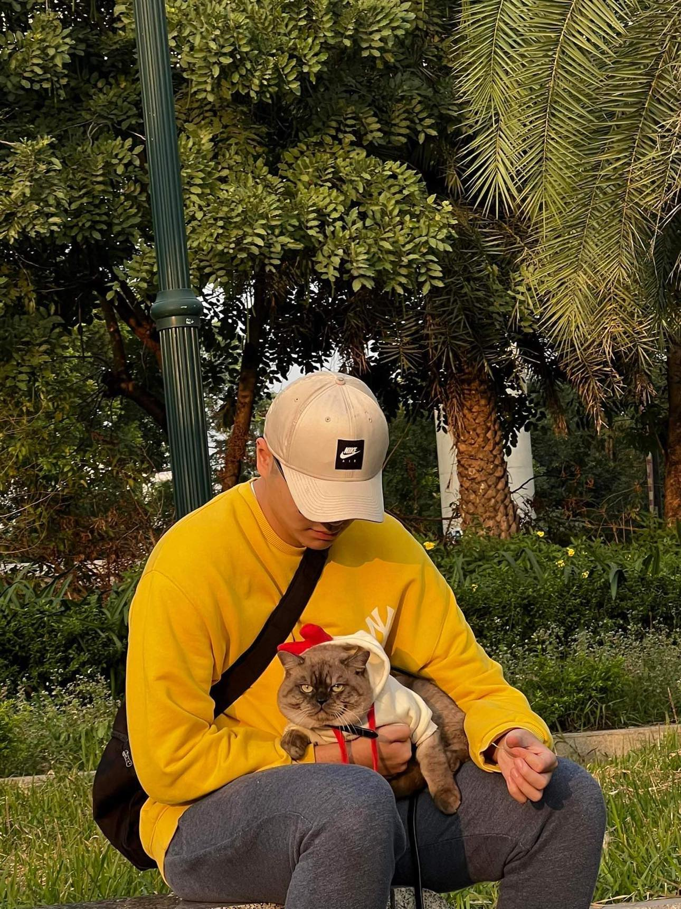

<!DOCTYPE html>
<html><head>
  <title>My Website</title>
  <meta name="viewport" content="width=device-width, initial-scale=1.0">
  
</head>
<body>
  

      <h1>My Page</h1>
    

    
  

  

    

      
      

        <h2>About Me</h2>
        
Chào tất cả mọi người tôi tên là Trịnh Đức Bình, hiện tại tôi đang sinh sống và học tại trường Quản Trị Kinh Doanh của Đại học Quốc Gia Hà Nội. Hiện tại tôi đang làm thêm tại 1 nhà hàng ở Thái Hà. Sở thích của tôi là chơi thể thao và xem phim. Sau đây là website của bản thân tôi. 

      

    

    

      <h2>Information</h2>
      
Name: Trịnh Đức Bình

      
Age: 20

	  
Date of birth: 22/09/2003
	  

Email: dbinh2323@gmail.com

	  
Phone: 0976562288

      
Address: Ha Noi

    

    

      <h2>Skills</h2>
      <table>
        <tbody><tr>
          <th>Skill</th>
          <th>Description</th>
        </tr>
        <tr>
          <td>Kĩ năng giao tiếp với người nước ngoài</td>
          <td>Tiếng anh hiện nay đang là một trong những ngôn ngữ rất phổ biến và cần thiết trong công việc cũng như là đời sống.Với tấm bằng ielts 6.5 thì tôi có thể giao tiếp với người nước ngoài một cách tự nhiên và có thể nói là theo cách cơ bản nhất</td>
        </tr>
        <tr>
          <td>Kỹ năng quản lý thời gian</td>
          <td>Thời gian chính là một thứ vô cùng quý giá, một khi đã trôi qua thì sẽ không thể lấy lại được. Đối vơi tôi việc quản lí thời gian rất quan trọng,nó giúp tôi kiểm soát được nhiều thứ và hoàn thành được nhiều việc. Vậy nên tôi luôn tìm cách phân bổ một cách đúng nhất và luôn đến đúng giờ những lúc quan trọng.</td>
        </tr>
        <tr>
          <td>Kỹ năng giải quyết vấn đề</td>
          <td>Cuộc sống, công việc mỗi ngày có rất nhiều tình huống bất ngờ xảy ra. Để có thể giải quyết êm đẹp,tôi có khả năng lắng nghe, phân tích, từ đó đưa ra cách xử lý phù hợp.</td>
        </tr>
      </tbody></table>
    

    

      

      <h2>Contact</h2>
      <form>
        

          <label for="name">Your Name</label>
          <input type="text" id="name" name="name" required="" />
        

    
        

          <label for="email"> Your Email</label>
          <input type="email" id="email" name="email" required="" />
        

    
        

          <label for="message">Message</label>
          <textarea id="message" name="message" required=""></textarea>
        

    
        <button type="submit">Send Message</button>
      </form>
    

    

    

      <h2>Photo Gallery</h2>
      
      
      
    

	<h1>My Social Media</h1>
    

      
      
    

  

  

</body></html>
